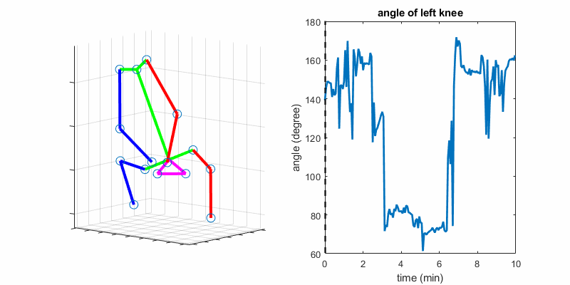

# fetal-motion

fetal motion analysis using 3D keypoint data

<p align="center">
   
</p>

## data

The input data are the 3D coordinates of each keypoint in each frame.
The keypoint of a subject should be in a `.mat` file.

```
data
├── subject1.mat
├── subject2.mat
├── ...
```

Each `.mat` file has an array `joint_coord` with shape of `(T, 3, K)`,
where `T` is the number of frames,
`3` is the three dimensions (x, y, z),
and `K` is the number of different keypoints, which is 15 in our work.

label keypoints id

```
% matlab is 1-indexed
 1: ankle (left)
 2: ankle (right)
 3: knee (left)
 4: knee (right)
 5: bladder
 6: elbow (left)
 7: elbow (right)
 8: eye (left)
 9: eye (right)
10: hip (left)
11: hip (right)
12: shoulder (left)
13: shoulder (right)
14: wrist (left)
15: wrist (right)
```

Information of each subject is stored in `data.xlsx`, which consists of 4 columns.

```
name: a unique name of the subject, which should be matched with the file name in ./data
duration: duration of the scan in min
GA_week 
GA_day
```

## example

Run `example_metric.m` for an exmaple. The results will be stored in `results.xlsx`.

## citation

```
@article{vasung2022cross,
  title={Cross-sectional Observational Study of Typical in-utero Fetal Movements using Machine Learning},
  author={Vasung, Lana and Xu, Junshen and Abaci-Turk, Esra and Zhou, Cindy and Holland, Elizabeth and Barth, William H and Barnewolt, Carol and Connolly, Susan and Estroff, Judy and Golland, Polina and others},
  journal={Developmental Neuroscience},
  publisher={Karger Publishers}
}

@InProceedings{10.1007/978-3-030-32251-9_44,
author="Xu, Junshen and Zhang, Molin and Turk, Esra Abaci and Zhang, Larry and Grant, P. Ellen and Ying, Kui and Golland, Polina and Adalsteinsson, Elfar",
title="Fetal Pose Estimation in Volumetric MRI Using a 3D Convolution Neural Network",
booktitle="Medical Image Computing and Computer Assisted Intervention -- MICCAI 2019",
year="2019",
publisher="Springer International Publishing",
address="Cham",
pages="403--410",
isbn="978-3-030-32251-9"
}

@InProceedings{10.1007/978-3-030-60334-2_20,
author="Xu, Junshen and Zhang, Molin and Turk, Esra Abaci and Grant, P. Ellen and Golland, Polina and Adalsteinsson, Elfar",
title="3D Fetal Pose Estimation with Adaptive Variance and Conditional Generative Adversarial Network",
booktitle="Medical Ultrasound, and Preterm, Perinatal and Paediatric Image Analysis",
year="2020",
publisher="Springer International Publishing",
address="Cham",
pages="201--210",
isbn="978-3-030-60334-2"
}
```
